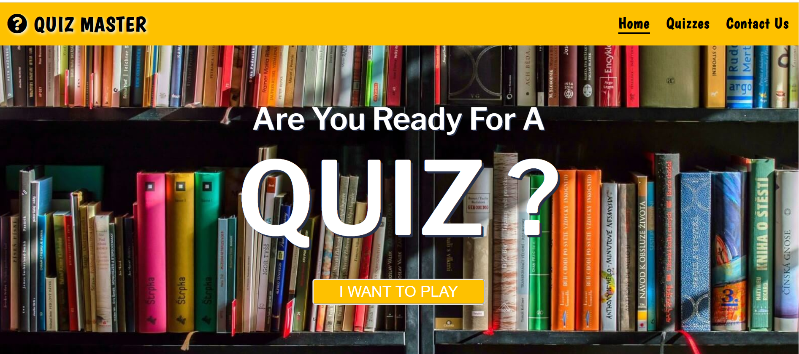
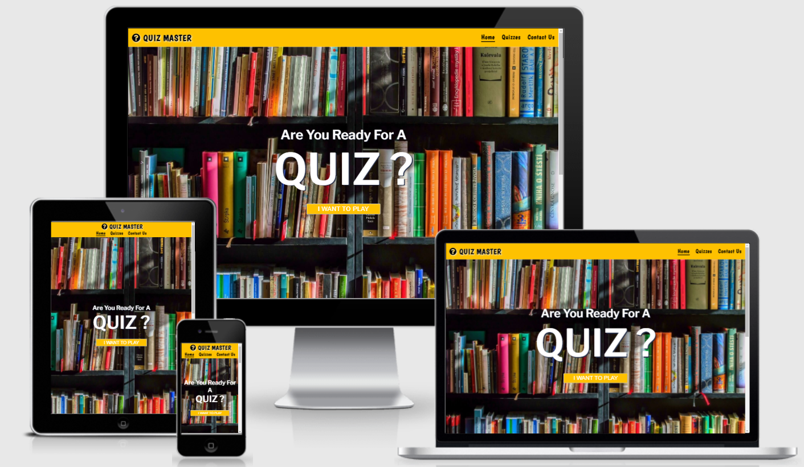
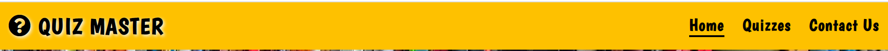
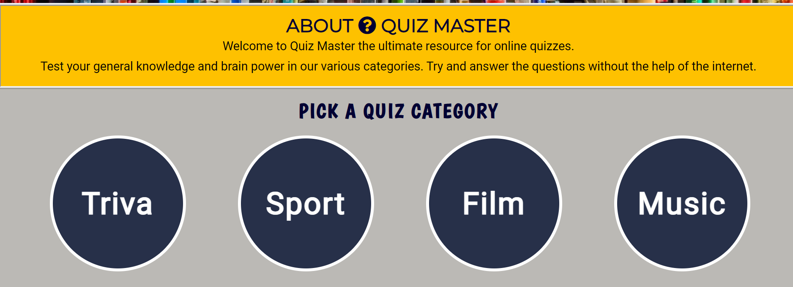
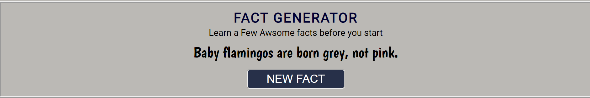

# Quiz Master

- You can see the live website [here](https://wlillisdev.github.io/quiz-master/)..

This website is designed for Quiz Master who is an online quizz company. Their aim is to become the market  leader in online quizzes and be a hub for quizz lovers all over the world.

# Aim of Website

The goal of the website is to create a trustworthy  online resource for users from all over the world to play quizzes & learn interesting  facts. Currently there are 4 main quiz topics.

- ### Triva
- ### Sport
- ### Film
- ### Music

Each quiz has multiple choice answers giving the user a choice  of 3 answers for each question. With the aim of retaining the user on the website as long as possible.  
The user is also given the answers after the quiz so they can see where they went wrong and build a level of trust between the user and the site.
The site will be targeted toward  Adults initally, but with the aim to also build out children’s quizzes and more interactivity at a later stage.

# User Stories
- First Time Visitors Aims:
  - As a first-time visitor, I want to quickly and easily understand what this website is about and what it can do for me.
  - As a first-time visitor, I want to quickly learn what type of quizzes are on offer.
  - As a first-time visitor, I want to be able to easily navigate around the site to find the content I'm looking for.

- Returning Visitors Aims:
  - As a returning visitor, I would like to learn about different  quiz categories and try more quizzes.
  - As a returning visitor, I want to interact with fact generator and interesting  facts map of the world. 
  - As a returning visitor, I would like to find links to their social media channels and follow them.

# Responsive 
The website has been designed to operate on a number of screens and devices.The following tests were carried  out on [Am I Responsive](http://ami.responsivedesign.is/)
 - Homepage (displayed below)

 - Quizzes Page [Am I Responsive Test services Page ](assets/readme/services-page-responsive.png)

 - Quizz Page [Am I Responsive Test contact Us Page](assets/readme/quiz-page-responsive.png)
 
 - Contact Us [Am I Responsive Test Thank You Page](assets/readme/contact-responsive.png)

# Features 

 [View Homepage Featuers](https://wlillisdev.github.io/quiz-master/index.html)

__Favicon__
 - As the company logo is a question mark i combined this with yellow branding to make an eye catching Favicon.
  

__Navigation Bar__
 
  - The Navigation bar is located at the top of all  Pages. It is simple but clean design. It includes the logo, Home page, Quizzes and Contact Us page.
  - It will allow a visitor to quickly and easily get around the site as each link logically leads to the next.
  - The nav elements also change colour when hovered over and also has an active line under each link when clicked which adds to the user experience.  

 

__Landing Page__

  - The landing page contains an eye-catching background image of a shelves of books that infers the theme of knowledge and quizzes.
  - The text are you ready for  is animated  on page load and catches the users attention straight  away, it is bold and white and contrasts well with background image.
  - It also has a call to action with a button i want to play,that jumps to the category section of the homepage.

 

__About Us & Quiz Category__

  - About Us section is a very brief description about Quiz Master to quickly give the user more information about the company.
  - The Quizz Category section, quickly shows the four main quiz categories.Triva,Sport,Film,Music.
  - Each Category will change color once hovered over, once clicked it will lead the user to the quiz page.

 

__Fact Generator__

  - This is a fun app that will create a new random interesting  fact every time the user clicks on the button.
  - This is aimed at grabbing a new users attention and helping to encourage  a user to click on a quiz after playing.
  - The button has a hover effect and will change color once clicked.

 

__Footer__

  - The footer is simple and clean design it is the same on all pages of the website.
  - It contains 3 social media platforms as requested by Quizz Master they will also open in a new window to allow easy navigation for the user.
  - The main aim of the footer is to increase engagement with visitors.With the goal of getting the user to subscribe to the channel in order to get updates on new quizzes. 

 

- __Hoover__

  - Each clickable element on the website changes color when hovered over with a mouse. This is to encourage users to click on buttons and links and increase engagement and user experience.
  

__Quizzes Page__

  -  This page clearly lays out the main quiz topics. The user can easily navigate to the diffrent quizzes.
  - Each specific quiz category has an eye catching image in relation to the different topics. Each topic has a button type icon in the centre of it that also has a hover effect to improve the users experience.
  - At the bottom of the page there is an interactive google map. The map has various markers at locations all around the world.
  - When the user clicks on the marker a info window appears and the users can view an interesting fact from this location.
  - This is aimed at improving  the users engagement  on the site. As all quiz lovers enjoys interesting  facts and information this map will cater for this need and provide some fun for the user as they take a break between quizzes.
  
  - Quizzes Page
 

 - Quizzes Page Google Map Feature
 

  [View Quizzes Page Featuers](https://wlillisdev.github.io/quiz-master/quizzes.html)

__Quiz Page__

  -  The quiz page is the same format on all quizzes, 5 questions with a multiple choice of 3 answers per question.The user answer is easily and quickly recorder in a radio input.

  - Quiz Page
 

  - The user has to answer all questions for the quiz to be successful. If they don't they will be given an alert saying you have missed a question.

  - Alert warning
 

  - At the end of the quiz the user presses get results  button, And a message tells them how many questions they have got correct.
  - The results is also accompanied with a GIF image, there a 3 different  images that relate to different  score ranges.
  - GIF for All Correct
  
  - The answers to the questions are also revealed  once the user has submitted at the end of the quiz.  
  
  [View Quiz Page Featuers](https://wlillisdev.github.io/quiz-master/quizz-triva.html)

__Contact Us Page__

 [View Contact Us Featuers](https://wlillisdev.github.io/quiz-master/contact-us.html)

  - It has a simple but elegant contact us form layout. That captures enough information so Quiz Master can follow up on the lead. And allows a user’s to quickly fill out the form with minimal information.
  - It also has a video background of question marks. It continues the animation theme and quesion mark logo from the home page it is fun and interesting.
 
 

__Thank You Page__
  - When the user successfully submits the contact us form, they will be brought to a thank you page. Which will also encourage the user to check out our social channels.
  

# Design
 - Theme
   - The Theme of the website was to build a bright and engaging Quiz website with a blend of both quizzes and fun. 
   - Fonts were imported from google fonts, Boogaloo was used for the logo and nav menu, Libre Franklin for hompage hero text, Montserrat for headings, and Roboto for body text.These were picked as they were crisp and complimented each other and the theme of the site.

 - Color Palette
   - The color palette is made up of four main colors which creates a good contrast and helps support the overall theme.

 

- Imagery
   - The images that were selected for the website were bold and bright images related to the Quiz Genre.

- Wireframes
   - To create the initial layout and wireframe I used Balsamiq. This helped fine tune the design and layout. It also helped in calculating the amount of content and images required.

  - 
  - [Quizzes Page Wireframe Concept](assets/readme/quizzes-wireframe-new.png)
  - [Quizz Page Wireframe Concept](assets/readme/quizz-wireframe.png)
   

# Future Development

- More Quiz Topics
  - As the site grows so will the resource of quiz topics and questions.

  - As the site grows we will intergrate an API into the random fact generator to generate an  infinite amount of new facts.        

- Children Quizzes 
  - Children Quizzes section will be added at a later date, to broaden the reach of the website.

- Subscription Section
  - The site will initially  have a number of quizzes free for everyone. But there will be an option for users to sign up to a monthly subscription service where they get exclusive quizzes every month.

- Other Games
  - As the site evolves  so will the amount of games on the site, initially  it is just quizzes, but it eventually have Crosswords, Word Search & Cryptograms.  

# Testing

### Validator Testing 

 - HTML Validator
   - [W3C](https://validator.w3.org/) site was used to validate the **HTML** code.
   - A number of small errors were initially flagged up. Some duplicate tags were removed and I also had to rename a number of images. I also misplaced a link tag in the homepage, as I copied this page structure for the rest of the site i had to fix it on all of these pages also
     - [Erros From Validator Hompage](assets/readme/html-home-error.png)
     - [Erros From Validator Quizzes](assets/readme/error-validator-quizzes.png)
     - [Erros From Validator Triva Quiz](assets/readme/validaor-error-triva-quiz.png)

   

 ### All Pages are now error free see links below:

 
   - [Homepage](https://validator.w3.org/nu/?doc=https%3A%2F%2Fwlillisdev.github.io%2Fquiz-master%2Findex.html)
   - [Quizzes Page](https://validator.w3.org/nu/?doc=https%3A%2F%2Fwlillisdev.github.io%2Fquiz-master%2Fquizzes.html)
   - [Triva Quizz](https://validator.w3.org/nu/?doc=https%3A%2F%2Fwlillisdev.github.io%2Fquiz-master%2Fquizz-triva.html) Error because image is hidden until event happens
   - [Sport Quizz](https://validator.w3.org/nu/?doc=https%3A%2F%2Fwlillisdev.github.io%2Fquiz-master%2Fsport-quizz.html) Error because image is hidden until event happens
   - [Film Quizz](https://validator.w3.org/nu/?doc=https%3A%2F%2Fwlillisdev.github.io%2Fquiz-master%2Ffilm-quizz.html) Error because image is hidden until event happens
   - [Film Quizz](https://validator.w3.org/nu/?doc=https%3A%2F%2Fwlillisdev.github.io%2Fquiz-master%2Fmusic-quizz.html) Error because image is hidden until event happens
   - [Contact Us Page](https://validator.w3.org/nu/?doc=https%3A%2F%2Fwlillisdev.github.io%2Fquiz-master%2Fcontact-us.html)
   - [Thank You Page](https://validator.w3.org/nu/?doc=https%3A%2F%2Fwlillisdev.github.io%2Fquiz-master%2Fthank-you.html%3Ffirst_name%3Dcdcd%26last_name%3Ddcdc%26email_address%3Dcdd%2540gmail.com)

## CSS Validator
  - The [W3C](https://validator.w3.org/) was used to validate the **CSS** code
  - The website passed with no errors

  

  ### See links below for Results:

   - [CSS Test Results](https://jigsaw.w3.org/css-validator/validator?uri=https%3A%2F%2Fwlillisdev.github.io%2Fquiz-master%2Findex.html&profile=css3svg&usermedium=all&warning=1&vextwarning=&lang=en)

 
## Lighthouse
 - Lighthouse testing was carried out in Developer Tools in Chrome. Initially it gave a number of improvements and flagged up a number of images that needed to be reduced in size. Which was done.

 - The results were also skewed as the chrome extensions on my testing device was affecting the lighthouse results. The tests of all pages were redone in a incognito window and performance score increased.

 
 - [Quizzes Page lighthouse results](assets/readme/quizzes-pages-lighthouse.png) results are slightly down mainly due to the integration  of google maps api.
 - [Contact Us lighthoust results](assets/readme/contact-lighthouse-crop.png)

 ## Java Script
 - The [JShint](https://jshint.com/) was used to validate the **JavaScrip** code
 - The results initally highlighted a few warnings.
     - [Erros From JShint](assets/readme/jshint-error.png)
     
 - Each item was addressed, The validation loop for the quizz was edited to remove eval. And stack overflow suggested adding / /*jshint esversion: 6 */ to the notes this prevented this error.

 
 
## Manual Testing
  - All the site links were manually tested to see if they all worked ok and linked to the correct locations.
  - The form was checked that name and email were required, that the radio buttons functioned and that the submit button worked.
  - The site was further tested using feedback from mentor,family and friends who checked it on different  devices they had.
  - All of the page's features were tested on Google Chrome, Microsoft Edge, Mozilla Firefox, Safari, and Opera .
  - Google Chrome's Developer Tool was used to inspect page elements during the build and helped identify  and debug issues within the HTML and CSS.
  - The README.md was checked before final submission and links verified.

# Bugs

  - After running the site through HTML checker, a number of small bugs were identified. Each error was identified and an appropriate solution applied, i went through all pages and fixed any errors. It was good lesson and practice in finding problems with code and fixing them.
  - After Running all the pages through lighthouse, it identified issues with a number of images due to size. Lighthouse suggested to change some larger images which was done.
  - Initially  i had a mouse over event listener  on google maps markers but this was no use for mobile which i realised  when testing, so i changed it to onclick event.
  - I had eval in my validate quiz function, jshint gave this as a warning and a potential security risk so i removed it.
  

  # Unfixed Bugs
  - I am aware there is a console.log Error with Permissions-Policy header: Unrecognized feature: 'interest-cohort'.From what i have researched this is a issue between Github and Google and has no effect on the sites performance.
  - I am aware the website has a lot of large rich images and although images were cropped and compressed it could lead to reduced speed until cached. I have experimented with next gen image formats but currently  they lack browser compatibility  so i just went with png compressed and cropped format for this site.

# Deployment

The site was created using Visual Studio Code and GitHub, and deployed to GitHub pages for testing using the below process:

 - Clicked on my respository for [wlillisdev/quizz-master](https://github.com/wlillisdev/quiz-master).
 - Clicked settings tab and navigated down to "pages"
 - Selected "Main" in branch drop down box.
 - Clicked "save" which produced the live link which can be viewed [here](https://wlillisdev.github.io/quiz-master/).. 

 ## Version Control
  - Git was used as the version control software. Commands such as git add ., git status, git commit and git push were used to add, save, stage and push the code to the GitHub repository.

## Cloning

1. On [GitHub](www.github.com), navigate to the main page of the repository.  [Click Here for Reposititory Link](https://github.com/wlillisdev/quiz-master)

2. Above the list of files, click Code.

3. click Use GitHub CLI, then click the copy icon.

4. Open Git Bash and change the current working directory to the location where you want the cloned directory.

5. Type git clone, and then paste the URL that was copied previously  in step 3.

6. Press Enter to create the local clone.

[git cloning steps with pictuers](https://docs.github.com/en/repositories/creating-and-managing-repositories/cloning-a-repository#cloning-a-repository-to-github-desktop)

# Credits

- ## Languages

  - [HTML5](https://en.wikipedia.org/wiki/HTML5)
  - [CSS](https://en.wikipedia.org/wiki/CSS)
  - [JavaScript](https://en.wikipedia.org/wiki/JavaScript)

- ## Content
   - The code for the contact us form was taken from the love running tutorial from [Code Institute](https://codeinstitute.net/ie/) and modified.
   - The icons used throughout the site were from [Font Awesome](https://fontawesome.com/)
   - Variour Youtube tutorial were used to help understand flexbox.
   - [Flexbox](https://www.youtube.com/watch?v=fYq5PXgSsbE)
   - Animated Text on home page from [bulldogpatch](https://codepen.io/bulldogpatch-the-sasster/pen/JjoyeGg)
   - Tutorials for Randon Fact generator from freecode camp ,learn web-dev & dev.to were used to inspire the generator.
   - YouTube videos from Eduonix Learning Solutions,Kevin Briggs & Web Dev Simplified were used as a base for the quizz.
   - Youtube videos about google maps api with javascript were followed from Traversy Media & Sam Codes.

    

-  ## Images
   - All images were taken from [Pexels](https://www.pexels.com/)

  
 -  ## Resources
    - [Stack Overflow](https://stackoverflow.com/)
    - [W3Schools](https://www.w3schools.com/)
    - [w3docs](https://www.w3docs.com/)
    - Notes & Videos from course work from [Code Institute](https://codeinstitute.net/ie/)

-  ## Tools
   - [Balsamiq](https://balsamiq.com/) - Used to create wireframes
   - [Google Fonts](https://fonts.google.com/) - Used to import fonts
   - [TinyPNG](https://tinypng.com/) - Used to compress images

-  ## Acknowledgements
 - Special thanks to my mentor Miguel Martinez
 for his help and guidance in the development of my project. Special thanks to my tutor Kasia and our regular class meeting’s and members of the awesome slack community

   # Conclusion
    - I would like to experiment more with javaScript but as i am only getting to grips with the language i kept concept simple.
    - If I was to build this site again, I would spend more time on the wireframes and know exactly how to structure each section and element before i start.
    - If i had time i would like to add a timer function to the quizz.    
    - I would also learn to make more commits during the project built.

   

